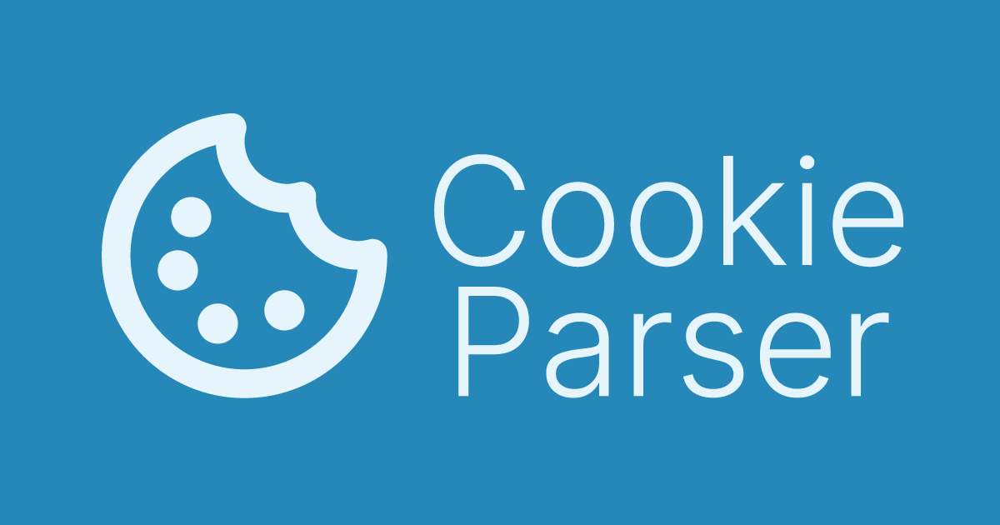

## Teacher's Dashboard API

### Table of Contents

- [Prerequisites](#Prerequisites)
- [Tech Stack](#Tech-Stack)
- [Getting Started](#Getting-Started)
- [Project Structure](#Project-Structure)

#

### Prerequisites

-  Node JS @16.X and up
-  npm @8 and up

#

### Tech Stack

-  bcrypt @ 5.1.1 - Library for hashing passwords.
-  cookie-parser @ 1.4.6 - Middleware for parsing cookies.
-  cors @ 2.8.5 - Middleware for enabling CORS in Express.
-  dotenv @ 16.4.5 - Zero-dependency module for loading environment variables.
-  express @ 4.19.2 - Web framework for Node.js.
-  jsonwebtoken @ 9.0.2 - Library for generating JWTs.
-  nodemailer @ 6.9.14 - Module for sending emails.
-  pg @ 8.12.0 - PostgreSQL client for Node.js.
-  pg-hstore @ 2.3.4 - Serializes and deserializes JSON data to hstore format for PostgreSQL.
-  sequelize @ 6.37.3 - Promise-based ORM for Node.js.
-  uuid @ 10.0.0 - Generates UUIDs.
-  ws @ 8.17.1 - Simple to use, blazing fast and thoroughly tested websocket client, server and console for node.js

#

### Getting Started

1. First of all you need to clone app repository from github:

```
git clone https://github.com/your-username/teachers-dashboard-api.git
```

2. Next step requires install all dependencies.

```
npm install
```

3. Also you need to create .env file where copy information from .env.example file

```
Create a .env file based on the .env.example template.
Update the variables with your PostgreSQL database connection URI and other configuration settings.
```

### Project Structure

```
src
├── config          # Configuration files
├── controllers     # Controller files
├── middlewares     # Middleware functions
├── models          # Database models
├── routes          # Router files
├── utils           # Utility functions
└── server.js       # Main server file

```

config: Contains configuration files such as database connection setup.
controllers: Handles business logic, interacting with models and returning responses.
middlewares: Includes middleware functions for handling requests before they reach the routes.
models: Defines data models using Sequelize for interacting with PostgreSQL.
routes: Defines API routes and their corresponding controller methods.
utils: Utility functions used across the application.
server.js: Entry point file that initializes and starts the Express server.
Feel free to adjust the sections and details according to your specific project setup and requirements. This README template provides a clear structure and instructions for setting up and understanding your English Education API project.
